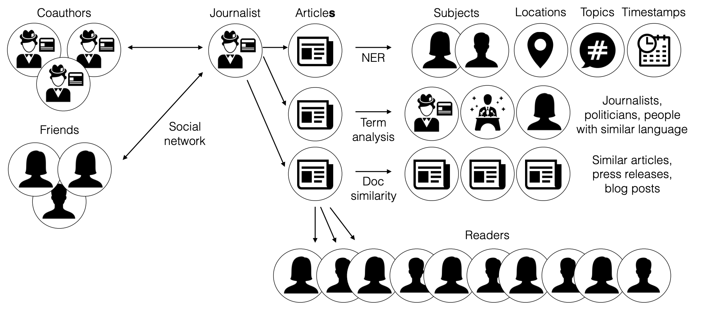

# Algorithmic fact checking

For how to install the project and code structure go 

Remember does not need to be perfect just useful and better than current benchmarks (which are nonexistant)

> The monopoly of truth is upstream of the monopoly of violence

- [Algorithmic fact checking](#algorithmic-fact-checking)
- [Project](#project)
  - [Approach - unbundling](#approach---unbundling)
    - [Data](#data)
      - [**Access to data**](#access-to-data)
      - [**Structure of data**](#structure-of-data)
      - [**Starting point**](#starting-point)
    - [NLP](#nlp)
      - [**NER**](#ner)
      - [**Quote extraction**](#quote-extraction)
      - [**Document similarity**](#document-similarity)
      - [**Language similarity**](#language-similarity)
      - [**Information extraction**](#information-extraction)
      - [**Document topic classification**](#document-topic-classification)
    - [Social network](#social-network)
  - [Approach - rebundling](#approach---rebundling)
    - [Echo chamber](#echo-chamber)
    - [Familiarity](#familiarity)
    - [Quote distortion](#quote-distortion)
    - [Expertise](#expertise)
    - [Unconscious bias](#unconscious-bias)
    - [Omission of contect](#omission-of-contect)
  - [Implemenation](#implemenation)
- [Code](#code)
  - [Installation](#installation)
  - [Project](#project-1)
  - [Tasks](#tasks)

---

# Project
This project aims to implement the first steps toward checking wether assertions made in an article are likely to be true. The approach to doing so is outlined in the following [slide show](https://assets.1729.com/algorithmic-fact-checking.pdf) by Balaji Srinivasan.

The reason it is important to implement scalable fact checking is because the information supply chain is broken. 

> Today every leader looks to their feed for information about what’s happening in the world. But the feed tells you what 
> is popular not what is true.

In order solve this we would ideally like to have an open source knowledge graph that anyone can query in order to discover what's likely to be true. The first step towards creating such a knowledge graph is to fact check the information feed.

For an outline of how a "knowledge graph" can be used too seperate facts from narratives see the following [lecture](https://www.youtube.com/watch?v=Cwbbxb987vE).


## Approach - unbundling
In order to asses the assertions made in an article the full context of the article must be taken into consideration. This is illustrated in the below picture, where an articles content and author(s) is assesed from multiple angles.




### Data
The two main obstacles two implement an algorithmic fact checking framework are:

#### **Access to data**

**Problem**: The data for assessing the full context of an article is mostly present in various databases but access to those databases is mostly restricted (Facebook, Linkedin, Twitter etc. give limited or no access to their databases).

**Trend**: sdfdfdsf

#### **Structure of data**

**Problem**: Text data lacks the neat 

**Trend**:

#### **Starting point**

The opposite is however true for web3 alternatives, where projects rely on an [open protocol in order to give people incentive to join the network](https://cdixon.org/2018/02/18/why-decentralization-matters). Hence, if web3 cryptonetworks grow in market share then we can build a fact checking framework around web3 infrastucture and then the framework will grow in precision and applicability as the corresponding web3 infrastrcutre grows.

As a starting point then [mirror.xyz](https://mirror.xyz/) is as the news feed and [cyberconnect.me](cyberconnect.me) is used for the social network data.

- **Mirror.xyz**: Mirror stores all the articles on Arweave - with tags - making it easy to query the feed. Furthermore every article contains metadata identifying the author by an ethereum address and the article timestamp etc.
- **Cyberconnect.me**: Cyberconnect aims to build the social graph infrastructure for web3. Currently they have indexed quite a few public data sources - such as bitclout - and the graph can be queried by [api](https://docs.cyberconnect.me/docs/GraphQL/graphql).


### NLP

#### **NER**
Named entity recognition is used to extract mentions of people, locations, organisations etc.. Extracting the named entities with high accuracy is starting to become relatively easy. Good NER models are accesible through huggingface.co for most big languages. As a starting point [flairs ner-english model](https://huggingface.co/flair/ner-english) is used.

#### **Quote extraction**
This task could probably be done fairly well by a deterministic approach using f.ex. https://stanfordnlp.github.io/CoreNLP/quote.html

#### **Document similarity**
Document similarity is used to detect similar articles. Currently their are multiple appraoches for assessing document similarity. As a starting point article text is converted to a vector using [Allen AI's specter model](https://huggingface.co/sentence-transformers/allenai-specter) and similarity search/clustering is then done using [facebooks faiss library](https://faiss.ai/).

Another baseline approach could be using [gensim](https://radimrehurek.com/gensim/)


#### **Language similarity**
Language similarity is used to detect people/organisations with similar language. An approach to this would be training a language model to classify, whether an article was written by a specific organisation/person. As an example a model could be trained to predict the likelihood of a text being written by a specific senator (and thereby implicitly predicting language similarity between an arbitrary article and a senator).

Various other ways to do this. See for instance the [paper](https://aclanthology.org/W10-0723.pdf) referenced in the slides


#### **Information extraction**
Information extraction refers to the task of extracting the assertions made in an article. In an NLP context this could [mean](https://github.com/explosion/spaCy/issues/3303): 

1) Given a document, extract all the entities. 
2) For each entity, extract all the possible knowledge triples.

Example:

Input: "Barrack Obama was born in Hawaii. He was president of the United States and lived in the White House"

Output:
- (Barrack Obama, was born in, Hawaii)
- (Barrack Obama, president of, United States)
- (Barrack Obama, lived in, White House)

This is an area of active research and there are different ways of going about it than the example above. Interesting repos in this area are. 

- https://github.com/zjunlp/DeepKE
- https://github.com/stanfordnlp/stanza
- https://github.com/zjunlp/OpenUE/blob/main/README_EN.md

The task is definitely doable but is - in my opinion - the most difficult (and interesting) of the NLP tasks described.

#### **Document topic classification**
Document topic classifiaction is used to extract the topics touched upon in an article. As a starting point a langauge model could be trained to predict a fixed set of highlevel topics such as science, political, sports etc.. Predicting even very high level labels would still be usefull and then the granularity of topic classification can increase over time.

### Social network

Various social network metrics for the author of the article can be calculated using the cybeconnect.me social graph and the author eth address, which is included in the mirror article metadata.
Example calucalation are such as average distance between nodes, node similarity etc. 

## Approach - rebundling

Once the article has been unbundled and processed in order to produce different analyses/metrics then these can be recombined in order to address problems commonly occuring in todays news feed. For concreate examples on these problems and more details see the [slides](https://assets.1729.com/algorithmic-fact-checking.pdf).

Below we wil ...


### Echo chamber

**Problem**: Many articles are rehashes of other articles. Hides the signal in noise.

**Solution**: Find overlap between articles and give credit to original author/source.

**Implementation**: Use document similarity to find similar articles and then determine overlap between articles and combine that with article timestamps to determine likely original author/source.

### Familiarity

**Problem**: Journalists quote friends or are very detached from the people they write about. If quoted people are friends then they might not be objective. If the journalist writes about people that are very far from the journalists own social network then it’s unlikely that the journalist can accurately convey their world view. As an example an american journalist, who has no relation whatsoever to chinese people is unlikely to be able to represent the chinese worldview accurately.

**Solution**: Determine social network distance between the journalist and the people the journalists writes about or interviews etc.

**Implementation**: Use named entity recognition to detect people mentioned in article. Use some form of dependency parsing/entity linking to determine context of the person mentioned in the artcile. Determine social network distance between journalist and detected people using web3 social grap.

In the example of an american journalist writing about the chinese people this would require the nodes in the social network graph would have metadata about nationality. While people might prefer that most metadata about them aren't publicable accessible this need not be a future barrier. The various network distance metrics can be [computed in a privacy preserving way](https://blog.oceanprotocol.com/how-ocean-compute-to-data-relates-to-other-privacy-preserving-technology-b4e1c330483) and then aggregates can be stored on chain.

### Quote distortion

**Problem**:Many quotes are distorted or taken out of context. These quotes are then often amplified to a large audience.

**Solution**: Tag people that are quoted and let them comment inline.

**Implementation**: [Extract quote and the person quoted](#quote-extraction) and check if the quoted person is a living person connected to the social graph. If so message them and allow them to comment. Could be implemented in various ways. People that are often quoted could for instance choose to onl be notified if an article has an "impact score" above a certain threshold etc.

### Expertise

**Problem**: Many journalists are generalists not specialists and as a result specialist information is often distorted or inaccurate.

**Solution**: Tag experts and ask them to comment.

**Implementation** Use document classification to detect topic. If topic requires specialist information find experts within topic and ask them to comment. If the web social graph over time gets linkedin style peer annotations of skills then this can be used to identify experts. Otherwise various databases with scientific documents can be used to identify authors of scientific articles closely related to the topic and then the authors can be asked to comment.

### Unconscious bias

**Problem**: Journalists are human and often have unconscious biases.

**Solution**: Detect unconscious bias through the use of language. If high impact article ask experts to comment

**Implementation**: Label various known partisan public figures/entities with a point estimate on an ideological axis. Use a [language similarity](#language-similarity) detection framework to detect similarity in language between an article and the labeled partisans. If the article has clear language similarity with a set of partisans their point estimate on the ideological axis is an approximation of the unconscious bias in the article.

### Omission of contect

**Problem**: Journalists have editorial pressure for a narrative, which can lead to selective omission of context.

**Solution**: Engage users to provide primary evidence. Tag users that are close in space and time, when an event occurs and ask them to comment.

**Implementation**: Use results


## Implemenation

# Code

## Installation

This project uses poetry as a package manager. In order to install dependencies run

```bash
poetry install
```

Some NLP packages have a lot of dependencies and installation of these might require a different approach depending on the operating system use. These dependencies are included in requirements.txt. You might try to install these by running.

```bash
cat requirements.txt|xargs poetry add
```

## Project

## Tasks


- Mention .env file
- Have all dependencies in poetry.toml and then list NLP dependencies in a requirements.txt
  Include command of how to install requirements.txt with poetry.
- 

